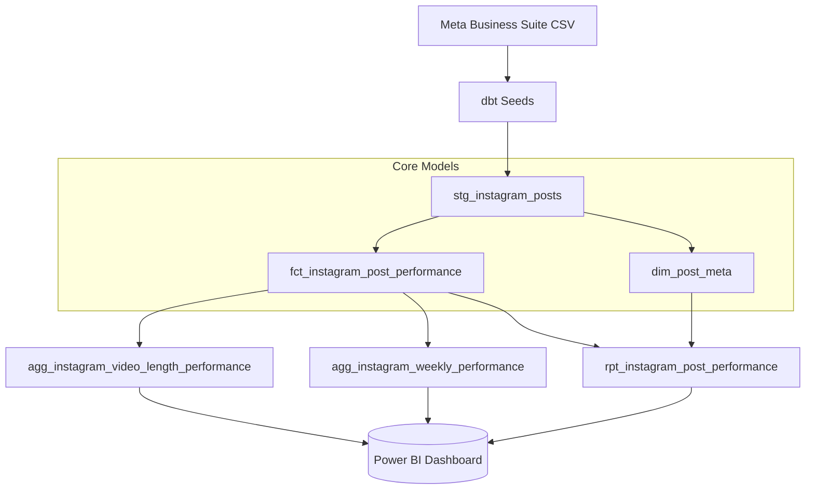

# 🏏 Sachin Tendulkar Instagram Analytics Pipeline

An Analytics Engineering project built with **dbt, DuckDB, and SQL** that transforms raw Meta Business Suite exports into clean dimensional models and dashboard-ready analytical tables.

This project analyzes 17 months of performance data from my own Sachin Tendulkar fan page using exports from Meta Business Suite to uncover actionable content strategy insights.

## 📊 Power BI Dashboard
<p align="center">
  
</p>
<p align="center">
  <em><b>Dataset:</b> 79 Instagram posts • ~17 months • Meta Business Suite exports</em>
</p>


## 🎯 The Business Goal
The goal of this project was to replace manual spreadsheet analysis with a reproducible analytics pipeline that produces consistent business metrics and dashboard-ready reporting tables. The resulting data marts answer key strategic questions:
* Which video length (short, medium, long) drives the highest true engagement rate?
* How does page performance trend week-over-week?
* What are the all-time top-performing posts based on a weighted global ranking?

## ✨ Key Findings

✅ Medium-length reels consistently achieved the highest engagement rate.
✅ **Stable Engagement Despite Uneven Reach:** Engagement rates remained relatively consistent across posts despite large differences in views and reach, suggesting that audience engagement alone does not explain why some posts reached far more people than others.
✅ **Viral Dependency:** Growth is driven heavily by outlier viral hits, not consistent baseline performance. While the *average* post receives 270k views, the *median* post receives only 12k. Just 10% of the posts accounted for 61% of the page's total 21M views.

## 🛠️ The Tech Stack
* **Data Transformation & Modeling:** dbt (Data Build Tool)
* **Database:** DuckDB (Local analytical database)
* **BI / Visualization:** Power BI
* **Version Control:** Git & GitHub

## 🏗️ Architecture & Data Modeling
This project follows a **Kimball-style dimensional modeling approach**, separating fact tables, dimension tables, and analytical marts to create a clean and scalable analytics layer.



### 1. Staging (`stg_`)
* `stg_instagram_posts`: Cleans raw Meta CSV exports, standardizes column names, and casts data types.

### 2. Core Models (`fct_` & `dim_`)
* `fct_instagram_post_performance`: A pure metric table (grain: 1 row per post). Contains views, reach, likes, and calculates baseline engagement rates.
* `dim_post_meta`: A pure attribute table. Contains descriptive metadata like captions, URLs, and video length buckets.

### 3. Data Marts (`agg_` & `rpt_`)
* `agg_instagram_video_length_performance`: Groups posts by video duration bucket. 
* `agg_instagram_weekly_performance`: Uses `date_trunc` to track volume and engagement trends on a weekly basis.
* `rpt_instagram_post_performance`: An enriched, wide report table utilizing Window Functions (`ROW_NUMBER()`) to assign global rankings to posts without requiring the BI tool to execute complex sorting logic.

## 🧠 Key Design Decisions

1. **True Rates vs. Averages of Averages**
   In the weekly aggregate mart, `weekly_engagement_rate` is calculated by summing total engagements and dividing by total reach (`SUM(engagements) / SUM(reach)`), rather than simply averaging the engagement rates of individual posts. This prevents skewed data when low-reach posts have viral engagement spikes.

2. **Handling Missing Reach Values**
   Meta exports occasionally omit `reach` data. In the final report mart, missing reach is handled gracefully. When ranking posts by engagement rate, the SQL utilizes `NULLS LAST` to ensure posts with missing denominators aren't falsely ranked as the #1 performing content.

3. **Lightweight BI Philosophy**
   All heavy aggregations, rate calculations, and window functions are executed upstream in DuckDB via dbt. This ensures the final Power BI dashboard acts only as a presentation layer, guaranteeing fast load times and metric consistency.

## 📁 Project Structure
```text
instagram-analytics-pipeline/
│
├── exports/                 # Generated CSVs for Power BI
├── models/
│   ├── staging/             # Initial cleanup models (stg_)
│   └── marts/               # Core facts, dims, and aggregates (agg_, rpt_)
├── seeds/                   # Raw CSV data from Meta Business Suite
├── tests/                   # Custom data validation tests
├── dashboard.png            # Screenshot of the Power BI dashboard
├── export_csvs.py           # Script to extract tables from DuckDB
└── dbt_project.yml          # dbt configuration
```

## 🚀 How to Run this Project
1. Clone the repository.
2. Ensure Python and `dbt-duckdb` are installed.
3. Run `dbt deps` to install dependencies.
4. Run `dbt seed` to load the raw CSV data into DuckDB.
5. Run `dbt build` to execute all models and run schema tests.
6. Run `python export_csvs.py` to generate dashboard-ready CSVs for Power BI.
