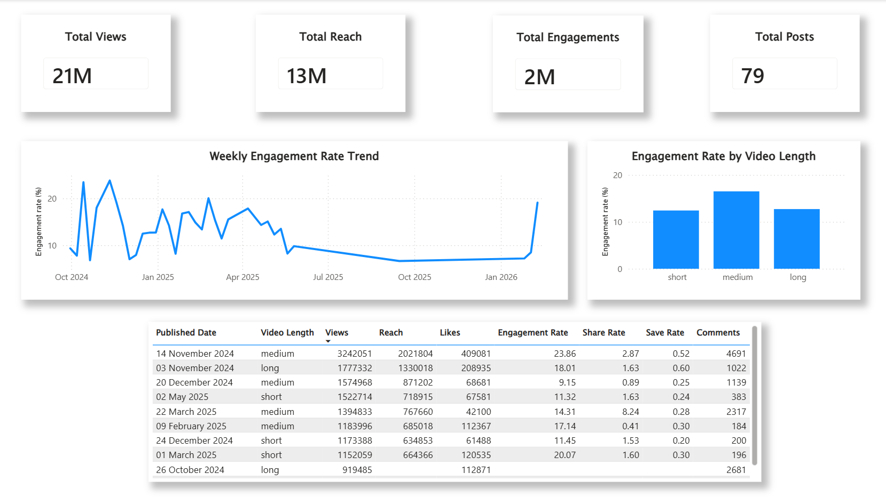

# Instagram Analytics Engine 🚀

An end-to-end modern data stack project that ingests raw Instagram performance data, transforms it using **dbt (Data Build Tool)** and **DuckDB**, and visualizes the insights in a premium **Power BI** dashboard.

## 📊 The Final Dashboard


## 🛠️ Tech Stack
- **Database Engine:** DuckDB (In-process, lightning-fast SQL OLAP database)
- **Data Transformation:** dbt (Data Build Tool)
- **Scripting & Orchestration:** Python
- **Data Visualization:** Power BI
- **Version Control:** Git & GitHub

## 🏗️ Architecture & Data Modeling
This project follows analytics engineering best practices, utilizing a strict modular data modeling approach:

1. **Sources (Raw Data):** Ingests raw JSON/CSV dumps of Instagram metrics.
2. **Staging (`stg_`):** Cleans up raw data, normalizes timestamps, casts data types, and standardizes column names.
3. **Intermediate (`int_`):** Handles complex logic, such as joining staging tables and calculating pre-aggregated metrics.
4. **Marts (`agg_` & `rpt_`):** The final presentation layer. 
   - `agg_instagram_overview`: High-level KPIs (Total views, reach, engagements).
   - `agg_instagram_weekly_performance`: Time-series trend data for weekly engagement rates.
   - `agg_instagram_video_length_performance`: Categorical performance based on video duration (Short, Medium, Long).
   - `rpt_instagram_post_performance`: Row-level detail report featuring top-performing posts and raw metrics.

## 🧠 Key Technical Challenges Solved
* **Complex Rate Calculations:** Engineered SQL logic to calculate true Engagement Rate `(Total Engagements / Reach)`.
* **Null Handling:** Implemented strict filtering logic to exclude posts with missing reach data from aggregate calculations, preventing mathematically impossible (e.g., 4,000%) engagement rates.
* **Dynamic Sorting:** Built custom surrogate sort columns in SQL to force BI tools to sort categorical buckets logically (Short -> Medium -> Long) rather than alphabetically.

## 🚀 How to Run Locally
1. Clone the repository.
2. Install dependencies: `pip install dbt-duckdb pandas`
3. Run the dbt models:
   ```bash
   dbt build
   ```
4. Export the final marts to CSV for Power BI:
   ```bash
   python export_csvs.py
   ```
5. Open Power BI and refresh the semantic model!
